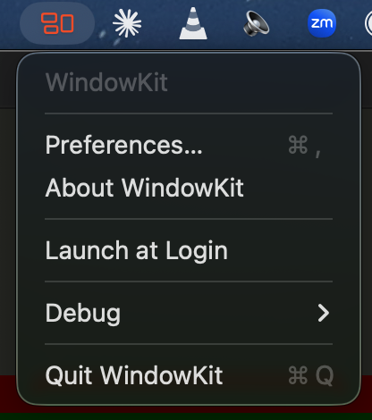
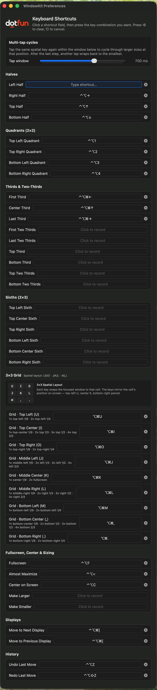

<h1>
  <a href="https://dotfun.co">
    <picture>
      <source media="(prefers-color-scheme: dark)" srcset="docs/images/DotfunLogoDark.png">
      
    </picture>
  </a>
  &nbsp;WindowKit — a free, open-source macOS window manager
</h1>

> A **free, open-source macOS window manager** with a spatial **3×3 keyboard grid** and **multi-tap cycles**. Snap, resize, and tile windows on your Mac with global keyboard shortcuts — a modern **Spectacle, Rectangle, Magnet, and Moom alternative**, built natively for **Apple Silicon** and licensed under **Apache 2.0**.

[](https://github.com/Dot-Fun/windowkit/releases/latest)
[](LICENSE)
[](#requirements)
[](#project-layout)

<p align="center">
  
  &nbsp;&nbsp;
  
</p>

## Why WindowKit?

WindowKit is a lightweight **menubar app for macOS** that snaps the focused window to halves, quadrants, thirds, sixths, a 3×3 spatial grid, or fullscreen — all with keyboard shortcuts. If you've used [Spectacle](https://github.com/eczarny/spectacle), [Rectangle](https://rectangleapp.com), [Magnet](https://magnet.crowdcafe.com), [BetterSnapTool](https://folivora.ai/bettersnaptool), or [Moom](https://manytricks.com/moom/), WindowKit will feel familiar — with a spatial-grid twist that is unique to it.

- **Free & open source** — Apache 2.0 licensed, no paywall, no telemetry, no account required.
- **3×3 spatial grid** — `U / I / O`, `J / K / L`, `M / , / .` map to the 9 screen positions. The keys' physical layout *is* the layout of the snap targets.
- **Multi-tap cycles** — tap the same shortcut twice/thrice/four times to progressively enlarge the window at that anchor. `⌘⌥I` once = top-center 1/9; twice = top 1/3; three times = top 1/2; four times = top 2/3.
- **Apple Silicon native** — arm64 build for M1 / M2 / M3 / M4 Macs on macOS 14 Sonoma or later.
- **Works with Electron apps** — Chrome, Discord, Cursor, VSCode, Slack. A one-time `AXEnhancedUserInterface` nudge per app per launch handles Chromium's usual Accessibility API quirks.
- **Dock-aware placement** — windows never cover a pinned Dock. Auto-hide Dock is handled the way macOS expects.
- **Configurable tap window** — 150 ms – 1 s in Preferences, default 700 ms.

## Compared to other macOS window managers

| | **WindowKit** | Spectacle | Rectangle | Magnet | Moom |
|---|:---:|:---:|:---:|:---:|:---:|
| Free | ✅ | ✅ | ✅ | ❌ ($4.99) | ❌ ($10) |
| Open source | ✅ Apache 2.0 | ✅ (archived 2017) | ✅ MIT | ❌ | ❌ |
| Halves / quadrants via keyboard | ✅ | ✅ | ✅ | ✅ | ✅ |
| Thirds / sixths / 2/3 bands | ✅ | ➖ limited | ✅ | ✅ | ✅ |
| **Spatial 3×3 grid** (U/I/O, J/K/L, M/,/.) | ✅ | ❌ | ❌ | ❌ | ➖ custom grid |
| **Multi-tap cycles** | ✅ | ❌ | ➖ repeat-resize | ❌ | ❌ |
| Drag-to-snap | ❌ | ❌ | ✅ | ✅ | ✅ |
| App-specific rules | ❌ | ❌ | ➖ | ❌ | ✅ |
| Native Apple Silicon | ✅ | ❌ (unmaintained) | ✅ | ✅ | ✅ |
| Menubar-only, no Dock icon | ✅ | ✅ | ✅ | ✅ | ✅ |

Use **Rectangle** if you love drag-to-snap. Use **Magnet** or **Moom** if you want paid-app polish and mouse gestures. Use **WindowKit** if you live on the keyboard and want the spatial-grid mental model.

**License**: Apache 2.0 — see [`LICENSE`](LICENSE). Provided "as is", without warranty of any kind, express or implied. The authors and dotfun are not liable for any damages arising from use of this software.

## Install (prebuilt)

1. Grab the latest **WindowKit-x.y.z.zip** from [Releases](https://github.com/Dot-Fun/windowkit/releases).
2. Unzip, drag **WindowKit.app** into **/Applications**.
3. Launch it. The menubar icon (orange 3×3 grid on dotfun orange) appears.
4. On first launch Gatekeeper will complain — the build is unsigned. Right-click the app → **Open** → **Open Anyway**, or run:
   ```bash
   xattr -dr com.apple.quarantine /Applications/WindowKit.app
   ```
5. Grant Accessibility when prompted (System Settings → Privacy & Security → Accessibility → toggle WindowKit on).

### Menubar menu

- **Preferences…** — rebind shortcuts, adjust the multi-tap window (150 ms – 1 s, default 700 ms)
- **About WindowKit** — logo + version
- **Launch at Login** — toggle auto-start with macOS
- **Debug → Copy Focused Window Info** — copies bundle ID / AX role / settable flags to the clipboard for bug reports
- **Quit WindowKit** — ⌘Q

## Requirements

- macOS 14+
- Swift 5.9+ / Xcode 15+
- Accessibility permission (for moving windows of other apps)

## Build

```bash
swift build -c release
```

Or open `Package.swift` in Xcode and build the `WindowKit` scheme.

### Package as .app

```bash
scripts/build-app.sh
```

Produces `build/WindowKit.app`. Double-click to launch; a menu-bar icon appears (the app is `LSUIElement`, no Dock presence).

## Run (dev)

```bash
swift run WindowKit
```

## Test

```bash
swift test
```

## Default Hotkeys

Legend: ⌃ = Control, ⌥ = Option, ⌘ = Command, ⇧ = Shift.

### Halves
| Action | Shortcut |
|---|---|
| Left half | ⌃⌥ ← |
| Right half | ⌃⌥ → |
| Top half | ⌃⌥ ↑ |
| Bottom half | ⌃⌥ ↓ |

### Quadrants
| Action | Shortcut |
|---|---|
| Top-left | ⌃⌥ 1 |
| Top-right | ⌃⌥ 2 |
| Bottom-left | ⌃⌥ 3 |
| Bottom-right | ⌃⌥ 4 |

### Thirds
| Action | Shortcut |
|---|---|
| First third | ⌃⌥⌘ ← |
| Center third | ⌃⌥⌘ ↑ |
| Last third | ⌃⌥⌘ → |

### 3×3 Spatial Grid (⌘⌥ + key)
Keys mirror the cell's on-screen position:

```
U I O
J K L
M , .
```

| Action | Shortcut |
|---|---|
| Top-left | ⌘⌥ U |
| Top-center | ⌘⌥ I |
| Top-right | ⌘⌥ O |
| Middle-left | ⌘⌥ J |
| Middle-center | ⌘⌥ K |
| Middle-right | ⌘⌥ L |
| Bottom-left | ⌘⌥ M |
| Bottom-center | ⌘⌥ , |
| Bottom-right | ⌘⌥ . |

### Sizing
| Action | Shortcut |
|---|---|
| Fullscreen | ⌃⌥ F |
| Center | ⌃⌥ C |
| Almost maximize (90%) | ⌃⌥ = |

### History
| Action | Shortcut |
|---|---|
| Undo window change | ⌃⌥ Z |
| Redo | ⌃⌥⇧ Z |

### Displays
| Action | Shortcut |
|---|---|
| Move to next display | ⌃⌥⌘ ] |
| Move to previous display | ⌃⌥⌘ [ |

All shortcuts are configurable in **Preferences → Keyboard Shortcuts** (⌘, from the menu bar).

### Multi-tap cycles

Each 3×3 grid key starts a cycle. Tapping the same key again within the **tap window** (default 700 ms, configurable 150 ms – 1 s in **Preferences → Shortcuts → Tap Behavior**) advances to a larger size anchored at that position. After the last step, another tap wraps back to the 1/9 cell. After the tap window elapses with no press, the counter resets and the next tap is a 1-tap again.

| Position | Keys | Cycle (1-tap → last) |
|---|---|---|
| Corners | U, O, M, . | 1/9 cell → matching quadrant (1/2 × 1/2) → 2/3 × 2/3 anchored at that corner |
| Top / bottom edges | I, , | 1/9 cell → top/bottom 1/3 band → top/bottom 1/2 → top/bottom 2/3 |
| Side edges | J, L | 1/9 cell → left/right 1/3 column → left/right 1/2 → left/right 2/3 |
| Center | K | 1/9 cell → 1/3 center column → fullscreen |

Tapping a *different* key resets the cycle — each key tracks its own counter.

### Known behaviors

- **Non-resizable apps** (e.g. System Settings panels) will be **moved** to the target location but keep their intrinsic size. WindowKit does not beep or error on move-only outcomes.
- **The Dock is respected** — snapped windows will not overlap a pinned Dock. The target frame is computed against `NSScreen.visibleFrame`, which excludes the Dock and menu bar.
- **Auto-hide Dock** lets windows use the full screen; the Dock overlays on hover (standard macOS behavior).

## Permissions

WindowKit requires **Accessibility** access to query and set frames of other apps' windows via `AXUIElement`. Without it, no hotkeys will take effect. On first launch the app shows an onboarding window with a button that opens **System Settings → Privacy & Security → Accessibility**.

### Unsigned-build caveat

Because this build is unsigned (and ad-hoc signatures change on every rebuild), macOS treats each new build of `WindowKit.app` as a distinct identity for Accessibility purposes. **After every rebuild you must:**

1. Open **System Settings → Privacy & Security → Accessibility**.
2. Remove any stale `WindowKit` entry.
3. Add the freshly built `WindowKit.app` and enable its toggle.

The onboarding window reappears whenever trust is revoked or invalidated, and hotkeys automatically disarm until trust is restored.

## Known app compatibility

- **Fully supported**: all native Cocoa apps (Finder, Safari, iTerm, Xcode, Terminal, Preview, Mail, Messages, etc.).
- **Electron / Chromium apps** (Chrome, Discord, Cursor, VSCode, Slack, etc.): supported via a multi-tier window resolver and a one-time `AXEnhancedUserInterface` nudge per app per launch. The first hotkey press on such an app may feel ~30 ms slower while Chromium rebuilds its AX tree; subsequent presses are instant.
- **Fixed-size apps** (EMEET Studio, System Settings panels, 1Password mini, Spotify mini): these will be **moved** to the target cell's origin but keep their intrinsic size — by design. No beep, no error.
- **Apps running as root or with full-screen space privileges** (most games, some installers): unreachable via the Accessibility API. This is a macOS limitation, not a WindowKit bug.

If a specific app doesn't respond, open the menubar menu → **Debug → Copy Focused Window Info** and share the clipboard contents — it contains the bundle ID, AX role/subrole, and which attributes are settable, which is enough to triage.

## FAQ

### Is WindowKit a free Spectacle alternative?
Yes. Spectacle stopped receiving updates in 2017. WindowKit keeps the same spirit — a keyboard-first, menubar-only Mac window manager — and adds a spatial 3×3 grid with multi-tap cycles to snap windows on Mac in one or more presses. Apache 2.0, no paywall, no telemetry.

### How does WindowKit compare to Rectangle?
Rectangle is the most popular modern Spectacle fork and is excellent if you love drag-to-snap. WindowKit has a smaller surface area — no mouse snapping, no app-specific rules — but it ships the spatial 3×3 grid (`U/I/O`, `J/K/L`, `M/,/.`) and multi-tap cycles that Rectangle doesn't. Both are free and open source. Pick whichever matches your mental model; they don't strictly conflict (though you may want to disable overlapping hotkeys in one of them).

### Does WindowKit work on Apple Silicon (M1, M2, M3, M4)?
Yes. The release binary is arm64-native, compiled against the macOS 14 SDK.

### Which macOS versions are supported?
macOS 14 Sonoma and later (Sonoma, Sequoia, and newer). Earlier versions are not supported — SwiftUI's `MenuBarExtra` requires macOS 13+ and some Accessibility APIs we rely on need Sonoma.

### Does WindowKit work with Chrome, Discord, Cursor, VSCode, or Slack?
Yes. Chromium/Electron apps get a one-time `AXEnhancedUserInterface` nudge from WindowKit the first time you press a hotkey on them per launch — after that, frame changes work as expected. The first press on a Chromium app is ~30 ms slower while it rebuilds its Accessibility tree; subsequent presses are instant.

### Why does WindowKit need Accessibility permission?
macOS requires Accessibility access for any app that reads or moves other apps' windows. This is the same permission Spectacle, Rectangle, Magnet, BetterSnapTool, and Moom all require. WindowKit only uses it to set window position and size — no keystroke logging, no screen recording, no network calls.

### Is WindowKit a Magnet or Moom alternative?
Yes, functionally. Magnet and Moom are polished paid apps (roughly $5 – $10 on the Mac App Store); WindowKit is free and open source. If you want drag-to-snap edges or app-specific autolayout rules, Magnet or Moom are still better choices. If you want keyboard-first minimalism, WindowKit is the lightest option.

### What's different about the 3×3 grid and multi-tap cycles?
Most window managers think in halves and quadrants. WindowKit adds a third mental tier: nine positional cells whose keyboard shortcuts are arranged *spatially* — the letters' physical position on your keyboard matches the cell's position on screen. Holding `⌘⌥` and pressing `M` snaps the window to the bottom-left 1/9; pressing `M` a second time within the tap window grows it to the bottom-left 1/4 quadrant; a third tap grows it to 2/3 × 2/3 in that corner. Center-row keys `I`, `K`, `,` grow in bands and columns.

### Where's the source? Can I contribute?
All of WindowKit is in this repository under Apache 2.0. Issues and PRs welcome. See [Project Layout](#project-layout) for the module map.

## Project Layout

- `App/` — SwiftUI `@main` app (MenuBarExtra), `ActionRunner`, `Info.plist`, assets
- `Sources/WindowEngine/` — pure `Geometry`, `AXWindow` wrapper, `ScreenResolver`, coordinate converter
- `Sources/HotkeyManager/` — Carbon global hotkeys
- `Sources/PreferencesStore/` — `Shortcut` model, `UserDefaults` persistence, default bindings
- `Sources/PreferencesUI/` — Preferences window, shortcut recorder, onboarding
- `Sources/PermissionsCoordinator/` — Accessibility trust checks + publisher
- `Sources/UndoStack/` — window frame history
- `Tests/WindowEngineTests/` — geometry unit tests
- `Tests/PreferencesStoreTests/` — store/shortcut tests
- `scripts/build-app.sh` — release bundle assembly

## Distribution

Unsigned local build. Not notarized. See unsigned-build caveat above.

## Release history

- **v0.2.4** — Corner keys (U, O, M, .) gain a 3rd tap: 2/3 × 2/3 in that corner.
- **v0.2.3** — `⌘⌥K` cycle adds a 1/3-wide center column between the 1/9 cell and fullscreen.
- **v0.2.2** — Works with Chromium/Electron apps (Chrome, Discord, Cursor, VSCode, Slack) via a one-time `AXEnhancedUserInterface` nudge. Tap window default raised to 700 ms; slider ceiling raised to 1 s.
- **v0.2.1** — dotfun branding, stale-grant detection, Launch at Login via `SMAppService`, Apache 2.0 LICENSE.

Full list on the [Releases page](https://github.com/Dot-Fun/windowkit/releases).

---

<p align="center">
  <a href="https://dotfun.co">
    <picture>
      <source media="(prefers-color-scheme: dark)" srcset="docs/images/DotfunLogoDark.png">
      
    </picture>
  </a>
</p>
